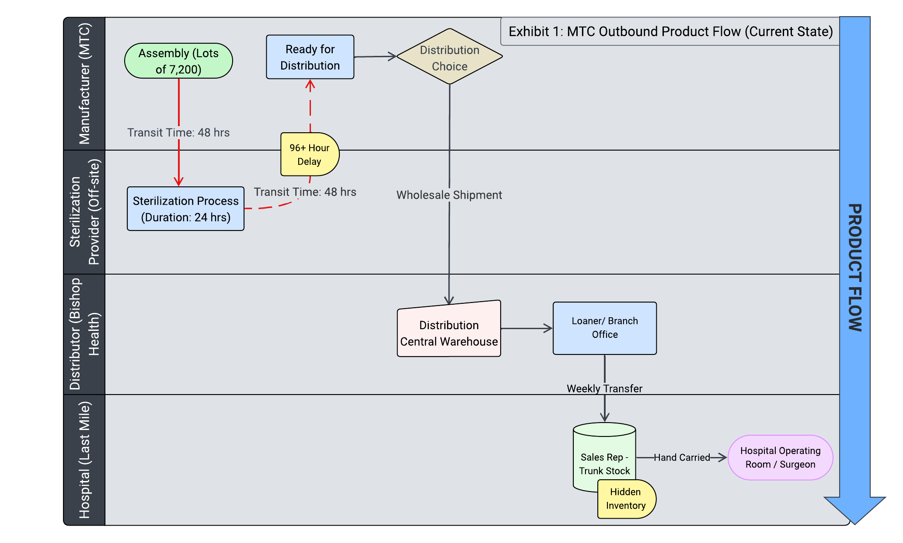

# hc Medical Device Supply Chain: Value Stream Mapping

## 📋 Executive Summary
In medical device logistics, "Trunk Stock" (inventory carried in sales reps' cars) often creates a blind spot for central planners. This project used **Lucidchart** to map the "Current State" flow of a medical device network, exposing critical time lags between assembly and the hospital operating room.

## 🚧 The Problem: "Hidden" Inventory
Visualizing the supply chain as a **Swimlane Diagram** revealed two major inefficiencies that spreadsheets missed:

| Bottleneck | Observation | Operational Impact |
| :--- | :--- | :--- |
| **Process Lag** | **96+ Hour Delay** at Sterilization | Inventory sits stagnant for 4 days at the off-site sterilization provider, increasing working capital requirements. |
| **Visibility Gap** | **Trunk Stock** | Sales reps carry significant inventory "in trunks" for last-mile delivery. This stock is invisible to the ERP, leading to demand forecasting errors. |

## 🗺️ Visual Analysis
*The "Current State" map showing the handoffs between Manufacturer, Sterilization, and Hospital.*

## 🛠️ Tools & Methodology
- **Tool:** Lucidchart (Process Mapping).
- **Method:** Value Stream Mapping (VSM) to identify Non-Value-Added (NVA) time.
- **Outcome:** Proposed a digital tracking system for Trunk Stock to reintegrate "invisible" units back into the central planning view.
